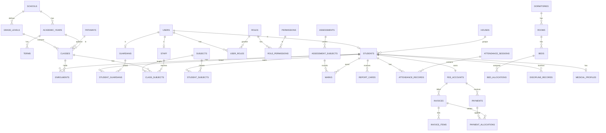

# DATABASE-DESIGN.md

**DBMS:** PostgreSQL 16 · **Migrations:** Prisma/Drizzle · **Single-school now, `school_id` on top-level tables for future multi-tenancy.**

## 1. Conventions

| Topic | Rule |
|---|---|
| Primary keys | `uuid` (v7 preferred), column `id` |
| Names | `snake_case`, plural tables |
| Timestamps | `created_at`, `updated_at` (`timestamptz`, UTC); display in EAT |
| Soft delete | `deleted_at timestamptz NULL` on students, staff, guardians, academic and finance data |
| Money | `bigint` in cents (KES ×100), column suffix `_cents`; currency column `KES` |
| Enums | Postgres enums or lookup tables for values admins may extend (assessment types, fee categories) |
| Auditing | `created_by`, `updated_by` on business tables; separate `audit_logs` |
| Indexes | FK columns, `(academic_year_id, term_id)` combos, search fields (trigram on names) |
| Integrity | FKs `ON DELETE RESTRICT` by default; no cascading deletes on records of value |

## 2. High-Level ERD



## 3. Table Definitions

### 3.1 Identity & Access
| Table | Key columns |
|---|---|
| `users` | id, email (unique, nullable), phone (unique, nullable), password_hash, status (`active/inactive/locked`), must_change_password, twofa_enabled, twofa_secret_enc, last_login_at, failed_attempts, locked_until |
| `roles` | id, name (unique), description, is_system |
| `permissions` | id, key (unique, e.g. `marks.update`), description |
| `role_permissions` | role_id, permission_id, scope (`all/department/assigned/class/own/children`) — PK (role_id, permission_id) |
| `user_roles` | user_id, role_id, department_id NULL, valid_from, valid_to |
| `refresh_tokens` | id, user_id, token_hash, family_id, expires_at, revoked_at, user_agent, ip |
| `password_resets` | id, user_id, token_hash, expires_at, used_at |
| `audit_logs` | id, user_id, action, resource, resource_id, old_values jsonb, new_values jsonb, ip, user_agent, created_at (append-only) |

### 3.2 School & Academic Structure
| Table | Key columns |
|---|---|
| `schools` | id, name, logo_url, motto, address, phone, email, website, registration_no, settings jsonb |
| `academic_years` | id, school_id, name (`2026`), start_date, end_date, status (`planned/active/closed/archived`) — one active per school |
| `terms` | id, academic_year_id, name, sequence, start_date, end_date, status |
| `grade_levels` | id, school_id, name (`Grade 10`, `Form 3`), sequence, is_legacy |
| `pathways` | id, school_id, name, parent_id NULL (for sub-options), is_active |
| `departments` | id, name, head_staff_id |
| `subjects` | id, department_id, code, name, category, is_compulsory, is_active |
| `subject_offerings` | id, subject_id, grade_level_id, pathway_id NULL — which subjects run where |
| `classes` | id, academic_year_id, grade_level_id, pathway_id NULL, name (`10A`), stream, class_teacher_id, room_id NULL, capacity |
| `class_subjects` | id, class_id, subject_id, teacher_id (staff) — unique (class_id, subject_id) |
| `enrolments` | id, student_id, class_id, academic_year_id, status, start_date, end_date — unique (student_id, academic_year_id) when active |
| `student_subjects` | student_id, subject_id, academic_year_id — electives/combinations |

### 3.3 People
| Table | Key columns |
|---|---|
| `students` | id, user_id NULL, admission_no (unique), first_name, middle_name, last_name, gender, dob, nationality, photo_url, status (`active/transferred/suspended/graduated/withdrawn`), admission_date, previous_school, house_id, residence (`day/boarder`), current_pathway_id, deleted_at |
| `guardians` | id, user_id NULL, first_name, last_name, relationship_default, phone, email, address, occupation, national_id_enc |
| `student_guardians` | student_id, guardian_id, relationship, is_primary, is_emergency, can_view_fees, can_view_discipline, can_view_medical |
| `staff` | id, user_id, employee_no, tsc_no NULL, first_name, last_name, gender, phone, email, department_id, employment_type, status, hired_on, qualifications jsonb |
| `student_transfers` | id, student_id, direction (`in/out`), other_school, date, reason, status |

### 3.4 Attendance
| Table | Key columns |
|---|---|
| `attendance_sessions` | id, class_id, date, period_id NULL, taken_by, submitted_at — unique (class_id, date, period_id) |
| `attendance_records` | id, session_id, student_id, status (`present/absent/late/excused`), note — unique (session_id, student_id) |

### 3.5 Assessment & Results
| Table | Key columns |
|---|---|
| `assessment_types` | id, name (`CAT`, `Project`, `End-term`), is_active |
| `grading_scales` | id, name, is_default |
| `grading_bands` | id, scale_id, grade, min_score, max_score, points, remark |
| `assessments` | id, term_id, assessment_type_id, name, weight_percent, grading_scale_id, status (`draft/open/locked/published`), opens_at, closes_at |
| `assessment_subjects` | id, assessment_id, class_id, subject_id, max_marks, teacher_id, status, locked_at, locked_by — unique (assessment_id, class_id, subject_id) |
| `marks` | id, assessment_subject_id, student_id, score numeric(6,2) NULL, status (`entered/absent/exempt`), entered_by, updated_by — unique (assessment_subject_id, student_id); CHECK score ≥ 0 |
| `mark_changes` | id, mark_id, old_score, new_score, reason, changed_by, changed_at (append-only) |
| `unlock_requests` | id, assessment_subject_id, requested_by, reason, status, decided_by |
| `result_summaries` | id, student_id, term_id, assessment_id NULL, total, mean, grade, points, class_position, stream_position, computed_at |
| `report_cards` | id, student_id, term_id, class_id, class_teacher_comment, principal_comment, status (`draft/approved/published`), pdf_url, generated_at, published_at |

### 3.6 Finance
| Table | Key columns |
|---|---|
| `fee_categories` | id, name (`Tuition`, `Boarding`, `Transport`) |
| `fee_structures` | id, academic_year_id, term_id NULL, grade_level_id, residence (`day/boarder/all`), name |
| `fee_structure_items` | id, structure_id, category_id, amount_cents |
| `fee_accounts` | id, student_id (unique), balance_cents (derived/cache), credit_cents |
| `invoices` | id, invoice_no (unique), fee_account_id, term_id, total_cents, status (`open/part_paid/paid/void`), issued_on, due_on |
| `invoice_items` | id, invoice_id, category_id, description, amount_cents |
| `payments` | id, receipt_no (unique), fee_account_id, amount_cents, method (`mpesa/bank/cash/card/other`), reference (unique per method), received_on, recorded_by, status (`posted/reversed`), reversal_of NULL, reversal_reason |
| `payment_allocations` | id, payment_id, invoice_id, amount_cents |
| `adjustments` | id, fee_account_id, type (`waiver/bursary/scholarship/penalty/credit`), amount_cents, reason, requested_by, approved_by, status |
| `unallocated_payments` | id, source (`mpesa`), raw_payload jsonb, reference, amount_cents, status |

Rule: **the ledger is append-only.** Balances are computed from invoices − allocations − adjustments; `balance_cents` is a cache updated in the same transaction.

### 3.7 Timetable & Assignments
| Table | Key columns |
|---|---|
| `periods` | id, name, start_time, end_time, is_break, sequence |
| `rooms` | id, name, type, capacity |
| `timetable_entries` | id, term_id, class_id, subject_id, teacher_id, room_id, day_of_week, period_id — unique (term_id, class_id, day, period) and (term_id, teacher_id, day, period) and (term_id, room_id, day, period) enforce conflicts |
| `assignments` | id, class_subject_id, title, description, due_at, max_marks, created_by |
| `assignment_submissions` | id, assignment_id, student_id, file_url, submitted_at, score, feedback |

### 3.8 Boarding & Houses
| Table | Key columns |
|---|---|
| `houses` | id, name, colour, housemaster_id |
| `house_points` | id, house_id, student_id NULL, points, category, reason, awarded_by, awarded_on |
| `dormitories` | id, name, gender, capacity, boarding_admin_id |
| `dorm_rooms` | id, dormitory_id, name |
| `beds` | id, dorm_room_id, label, status |
| `bed_allocations` | id, bed_id, student_id, start_date, end_date — partial unique index on active allocations (bed, student) |
| `boarding_attendance` | id, date, session (`morning/evening`), student_id, status |
| `exeats` | id, student_id, reason, leave_at, expected_return_at, returned_at, status, approved_by |

### 3.9 Discipline, Medical, Library, Transport, Inventory
| Table | Key columns |
|---|---|
| `discipline_categories` | id, name, severity |
| `discipline_records` | id, student_id, category_id, occurred_on, description, reported_by, action_taken, status, parent_notified_at, resolved_at |
| `medical_profiles` | id, student_id (unique), blood_group, allergies_enc, conditions_enc, emergency_contact |
| `medical_visits` | id, student_id, visited_at, complaint_enc, diagnosis_enc, treatment_enc, referred_to, attended_by |
| `books` | id, isbn, title, author, category, publisher |
| `book_copies` | id, book_id, barcode (unique), status |
| `library_loans` | id, copy_id, borrower_type, borrower_id, issued_on, due_on, returned_on, fine_cents |
| `vehicles` | id, reg_no, capacity, status, driver_id |
| `drivers` | id, name, phone, licence_no, licence_expiry |
| `routes` | id, name, description |
| `route_stops` | id, route_id, name, sequence |
| `transport_assignments` | id, student_id, route_id, stop_id, vehicle_id, term_id |
| `assets` | id, tag (unique), name, category, location, condition, assigned_to, purchased_on, value_cents |
| `stock_items` / `stock_movements` | consumables with quantity and movement history |

### 3.10 Communication, Documents, Settings
| Table | Key columns |
|---|---|
| `announcements` | id, title, body, audience jsonb (roles/grades/classes), published_by, publish_at, expires_at |
| `messages` | id, sender_id, recipient_id, student_id NULL, body, read_at |
| `notifications` | id, user_id, type, payload jsonb, channel (`in_app/sms/email`), status, sent_at, provider_ref, error |
| `calendar_events` | id, title, type, starts_at, ends_at, audience |
| `documents` | id, owner_type, owner_id, category, file_key, mime, size, uploaded_by, is_restricted |
| `settings` | key, value jsonb, updated_by |
| `sequences` | name, last_value — admission/receipt/invoice number generators |

## 4. Key Constraints & Business Rules in the DB

1. One **active** academic year and term per school (partial unique index).
2. `marks.score ≤ assessment_subjects.max_marks` enforced by trigger and application.
3. A student has at most one active enrolment per academic year.
4. Timetable uniqueness constraints block teacher, class and room double-booking.
5. `payments.reference` unique per method prevents duplicate M-Pesa codes.
6. Locked `assessment_subjects` reject mark writes (trigger + service check).
7. `audit_logs`, `mark_changes`, ledger tables are append-only (no UPDATE/DELETE grants for the app role).
8. Sensitive columns (`*_enc`) are encrypted at application level (AES-256-GCM; key outside the DB).

## 5. Indexing (examples)
```sql
CREATE INDEX ON students (last_name, first_name);
CREATE INDEX students_trgm ON students USING gin ((first_name||' '||last_name) gin_trgm_ops);
CREATE INDEX ON enrolments (class_id) WHERE status = 'active';
CREATE INDEX ON attendance_records (student_id, session_id);
CREATE INDEX ON marks (student_id);
CREATE INDEX ON invoices (fee_account_id, status);
CREATE UNIQUE INDEX one_active_year ON academic_years (school_id) WHERE status = 'active';
```

## 6. Data Lifecycle
| Data | Retention |
|---|---|
| Students/results/fees | Kept permanently (archived, not deleted) |
| Audit logs | ≥ 7 years |
| Notifications | 12 months |
| Refresh tokens | Purged on expiry |
| Backups | Daily for 30 days, monthly for 12 months |

## 7. Seed Data
Roles, permissions (from PERMISSIONS.md), default grading scale, assessment types, discipline categories, fee categories, periods, and a Super Admin user.
