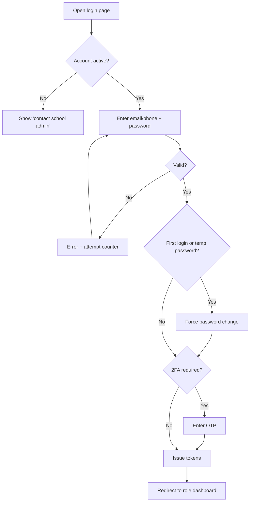
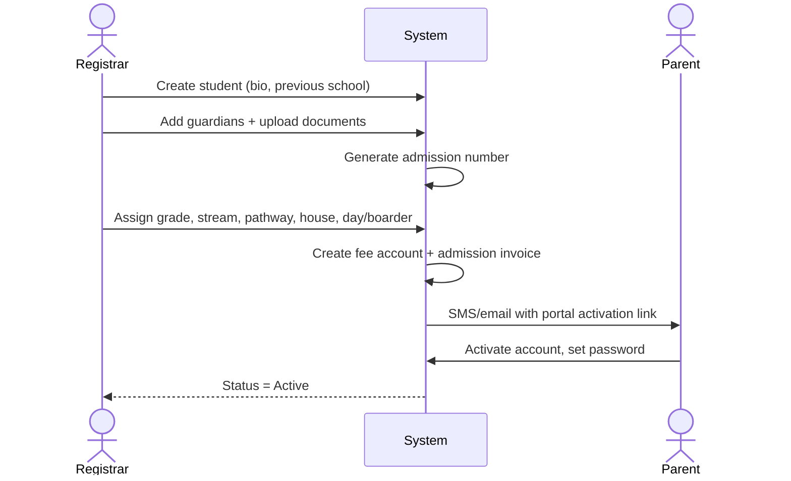
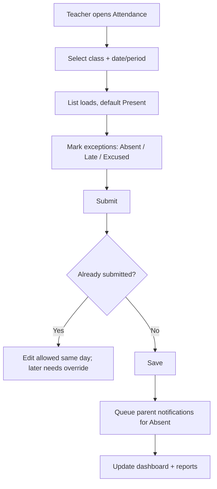
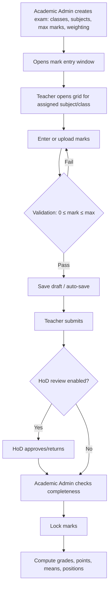
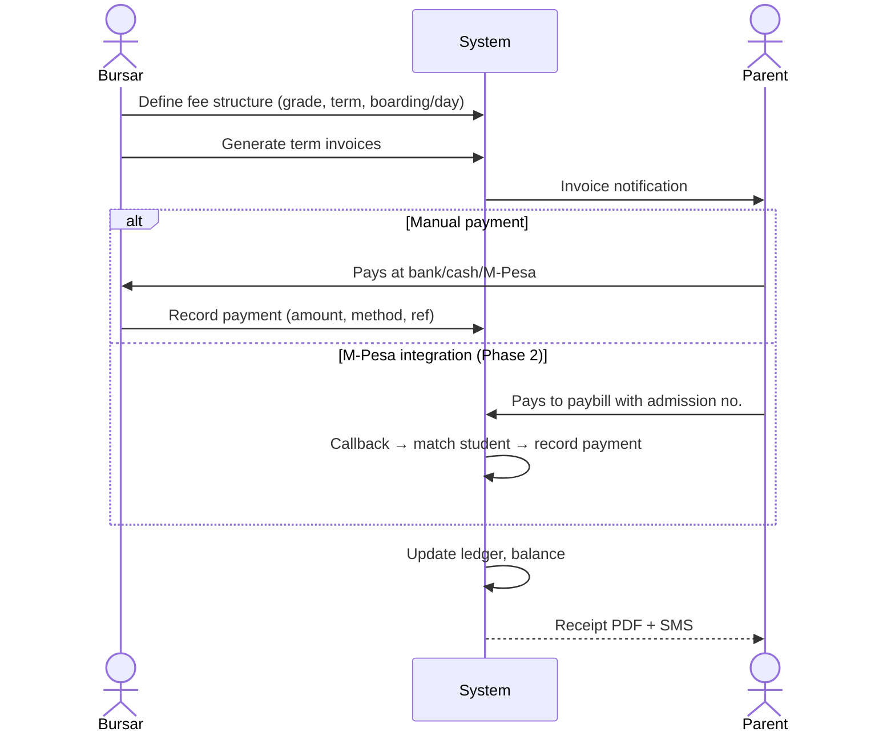
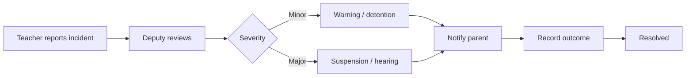

# USER-FLOWS.md

Flows map to requirements (FR-xxx) and permissions (PERMISSIONS.md). Diagrams use Mermaid.

## Index
1. Login & first-time setup
2. School setup (Super Admin / Academic Admin)
3. Student admission
4. Daily attendance
5. Assessment, marks entry and locking
6. Results publication & report cards
7. Fee invoicing and payment
8. Waiver / bursary
9. Discipline incident
10. Boarding allocation & exeat
11. Parent portal
12. Term close & year-end promotion
13. Library lending (summary)
14. Error and edge cases

---

## 1. Login & First-Time Setup

Rules: 5 failed attempts → 15-min lockout; refresh tokens rotate; forgot-password sends one-time link/OTP (FR-001 to FR-005).

## 2. School Setup (once per school)
```text
Super Admin
  1. School profile (name, logo, contacts)
  2. Create academic year → terms
  3. Define grades/forms → streams → class capacity
  4. Define departments → subjects → pathways
  5. Define grading scale + assessment types
  6. Define fee categories & houses/dormitories
  7. Create staff accounts and assign roles
  8. Import students (CSV) and guardians
  9. Activate the term
```
Blocking rule: attendance, marks and invoices cannot be created until an active year and term exist.

## 3. Student Admission (Registrar)

Validations: duplicate detection (name + DOB + guardian phone), unique admission number, required guardian with phone.

## 4. Daily Attendance (Teacher)

Edge cases: substitute teacher, student transferred mid-day, public holiday (blocked by calendar).

## 5. Assessment, Marks Entry and Locking

Corrections after lock: Teacher requests unlock with reason → Academic Admin (or Principal above threshold) approves → edit → relock → audit entry with old/new values.

## 6. Results Publication & Report Cards
```text
Academic Admin: check all marks locked
   → run computation (grades, means, positions)
   → Class Teachers add comments
   → Principal adds comment + approves
   → Generate report cards (batch PDF job)
   → Publish results
   → Notify parents ("Results are available")
   → Parents view/download in portal
```
Gate: report cards cannot be generated for a class with missing marks unless the admin marks them "absent/exempt" explicitly. Parents cannot view unpublished results (D7).

## 7. Fee Invoicing and Payment

Edge cases: overpayment → credit balance; unknown reference → "unallocated payments" queue; duplicate transaction code rejected.

## 8. Waiver / Bursary
```text
Bursar creates request (student, amount, reason, attachments)
   → Principal reviews → Approve / Reject (with note)
   → On approve: credit note posted to ledger
   → Parent notified; audit logged
```

## 9. Discipline Incident


## 10. Boarding Allocation & Exeat
```text
Boarding Admin: select student → choose dormitory/room/bed (capacity checked) → confirm
Exeat: parent/teacher request → Boarding Admin approves → departure/return logged → missed return triggers alert
```

## 11. Parent Portal
```text
Login → select child (if several) → Overview (attendance %, latest results, fee balance, announcements)
   ├── Results (published only) → download report card
   ├── Attendance calendar
   ├── Fees → statement → pay instructions / receipts
   ├── Timetable
   └── Messages with class teacher
```

## 12. Term Close & Year-End Promotion
```text
Term close: lock marks, publish results, post fee balances forward, archive attendance
Year-end: run promotion wizard
   → preview (Grade 10→11, 11→12, 12→Graduated)
   → exceptions (repeat, transfer, withdraw)
   → confirm → new year class lists created → balances carried forward → graduates archived
```
Wizard is reversible until the new year is activated.

## 13. Library Lending (summary)
Search book → issue to student (due date) → return → overdue triggers fine and reminder.

## 14. Error and Edge Cases
| Situation | Behaviour |
|---|---|
| Teacher not assigned to class | 403, message "You are not assigned to this class" |
| Entering marks after lock | Blocked; "Request unlock" action offered |
| Student moves stream mid-term | History preserved; marks stay with the original class record |
| Parent has two children in different grades | One login, child switcher |
| Offline/flaky connection during mark entry | Drafts saved locally, retried on reconnect |
| SMS fails | Retry 3×, then flagged in message log |
